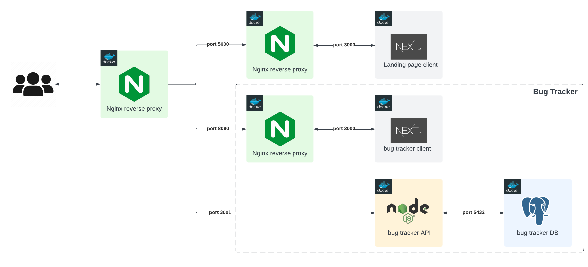

# Personal website - Landing page
[roysalazar.dev](http://3.76.1.136/) 

This project is a personal website which includes:
- A brief introduction about me and my skills.
- A projects page with links to sample work.
- A pricing page with different prices depending on different types of collaborations.
- Contact details

## Other related repositories

| Repository                                                                       | Description                                                                         |
| :------------------------------------------------------------------------------- | :---------------------------------------------------------------------------------- |
| [IAC - Infrastructure as code](https://github.com/roysalazarp/portfolio_iac)     | CDK project that provisions AWS services to host portfolio related projects. |
| [Bug tracker](https://github.com/roysalazarp/portfolio_apps_bug-tracker) | Full stack web application which purpose is to showcase my skills.                   |

## Architecture

